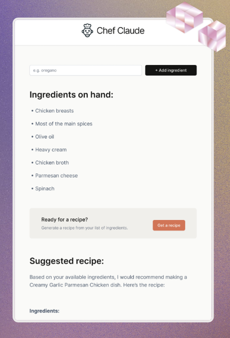

# Chef Claude 🍳

**Live demo:** [Kliknij tutaj, aby zobaczyć](https://marwoz01.github.io/chef-claude/)

Aplikacja pozwala wpisać listę składników, po czym wysyła je do **Claude API** i generuje propozycję **przepisu** do przygotowania z podanych produktów.  
**Projekt działa w wersji demo – klucz API jest ukryty.**

---

## Podgląd aplikacji

---

## Funkcje

- Dodawanie składników do listy
- Wysyłanie składników do Claude API
- Generowanie i wyświetlanie przepisu
- Prosty i responsywny interfejs

---

## Technologie

- **React** + Vite
- CSS
- Claude API (Anthropic)

---

## Co przećwiczyłem w projekcie

1. Event listeners
2. State
3. Conditional rendering
4. Forms
5. State management strategies
